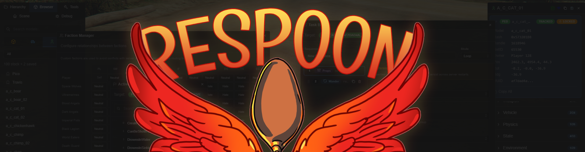
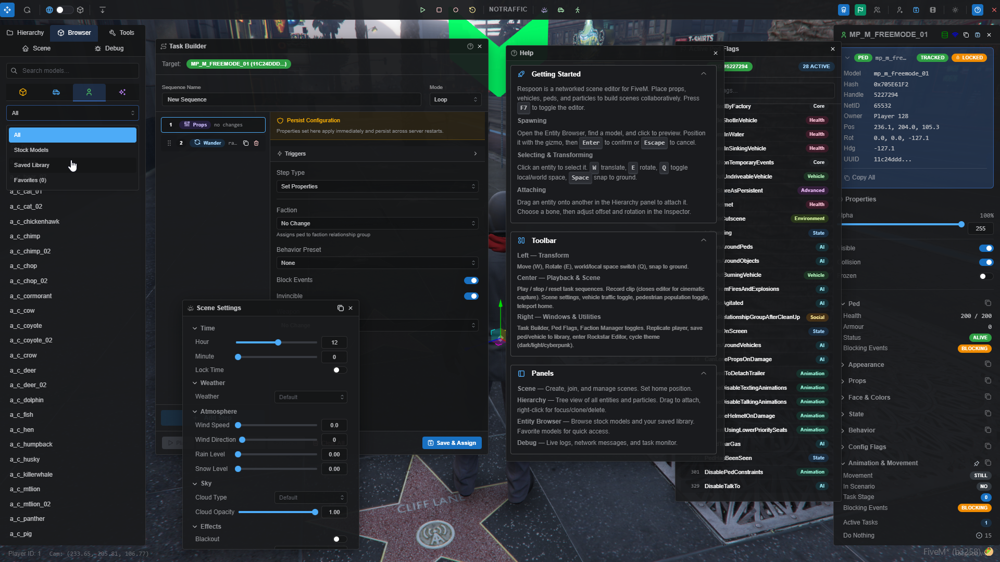
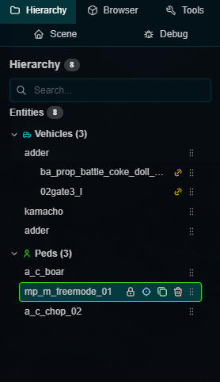
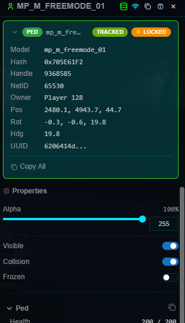
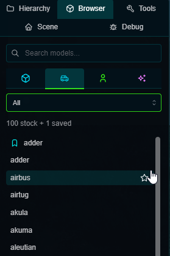
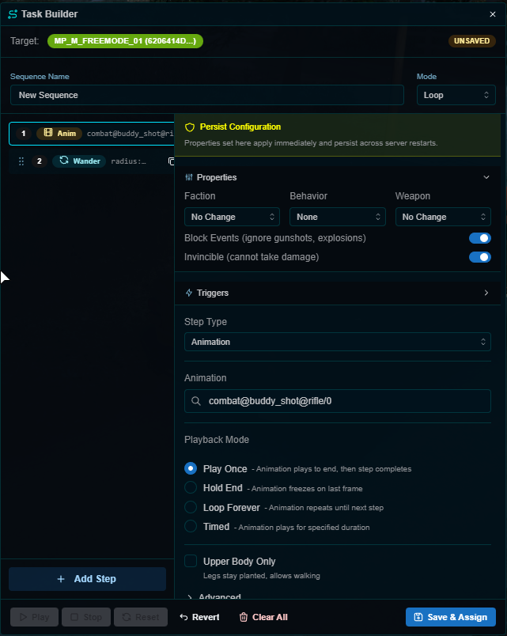
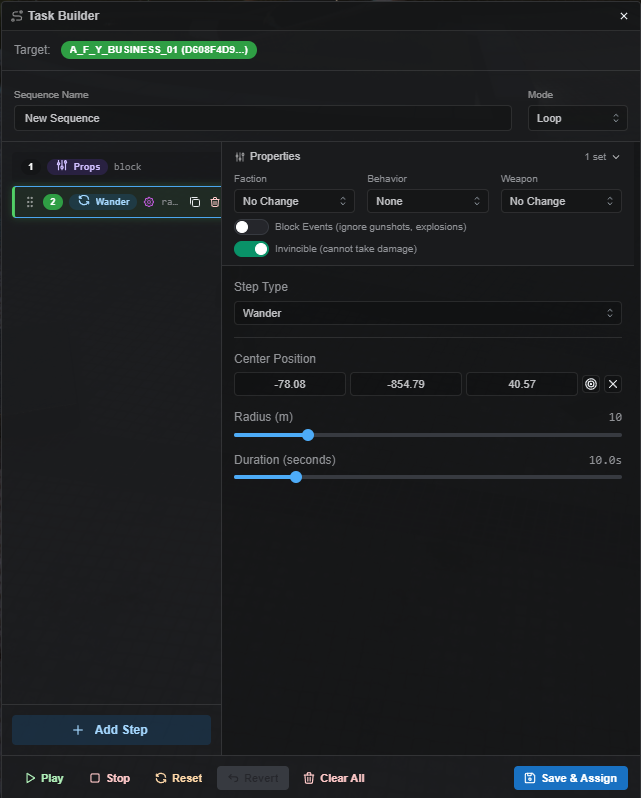

# Respoon

  

https://discord.gg/h9BtusuD

  
  
  

  A real-time development toolkit for FiveM. Inspect, edit, and script game entities without server restarts. 
  <strong><a href="https://discord.gg/mgumPaknVK">Discord</a></strong> · <strong><a href="docs/introduction.md">Documentation</a></strong>

---

## What is Respoon?

Respoon is a networked scene editor and development toolkit for FiveM. It gives server developers, content creators, and machinima producers a real-time entity inspector, AI scripting tool, environment controller, and collaborative workspace — all in one resource.

- **23,000+ searchable models** — props, vehicles, and peds
- **269,000+ animation clips** — full-text searchable
- **2,907 particle effects** across 364 dictionaries
- **21 ped AI step types** with visual task builder
- **20 environment properties** — time, weather, atmosphere, traffic, timecycles
- **62 concurrent isolated rooms** for parallel development
- **17 granular permissions** with role-based access control
- **8 server exports** for cross-resource integration
- **Real-time collaborative editing** with server-authoritative sync

## Screenshots

  

  
  
  

  
  

## Documentation

Full documentation is available in the [docs](docs/) directory:

- [Introduction](docs/introduction.md) — What Respoon is and who it's for
- [Getting Started](docs/getting-started.md) — Your first session
- [Features](docs/features.md) — Complete feature overview
- [Installation](docs/installation.md) — Server setup guide
- [Permissions](docs/permissions.md) — ACE permissions and room roles
- [Keyboard Shortcuts](docs/shortcuts.md) — Full shortcut reference
- [Exports API](docs/exports.md) — Cross-resource integration
- [FAQ / Troubleshooting](docs/faq.md) — Common questions and fixes

## Requirements

- FiveM server (artifact build 5181+)
- MySQL 5.7+ or MariaDB 10.2+
- oxmysql (recommended) or any mysql2-compatible driver

## Support

**[Discord](https://discord.gg/mgumPaknVK)** — bug reports, feature requests, and support.
